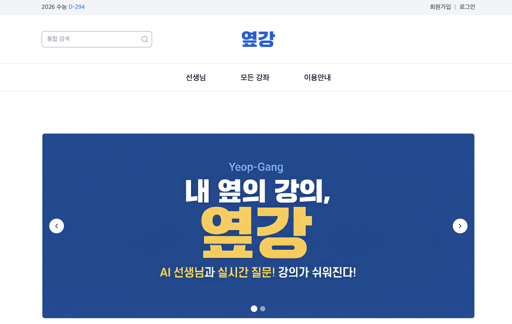
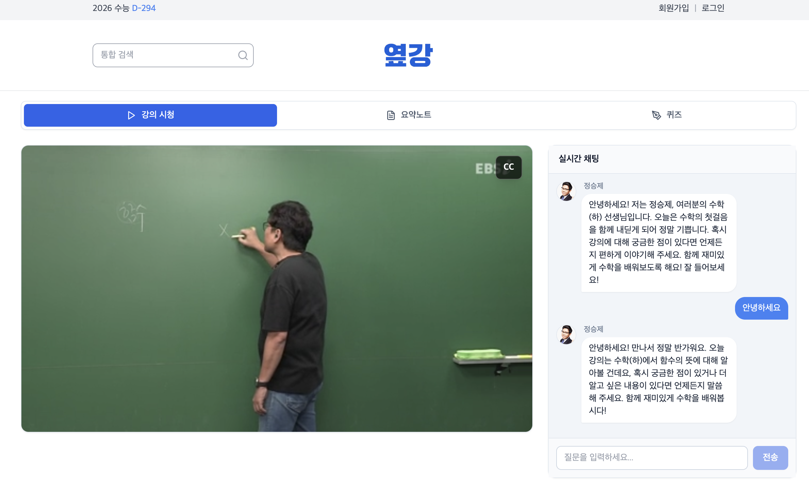
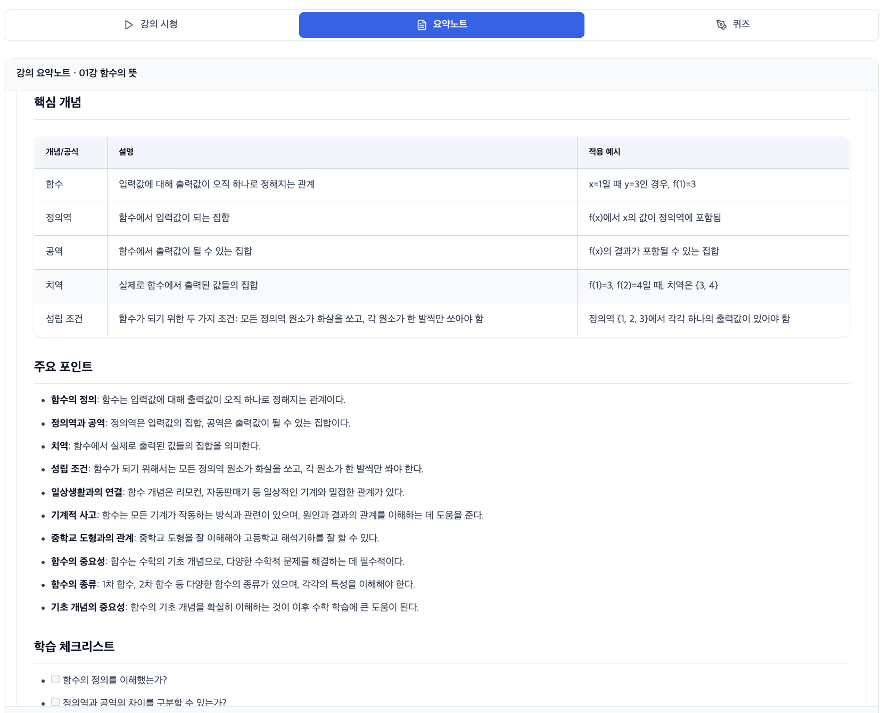
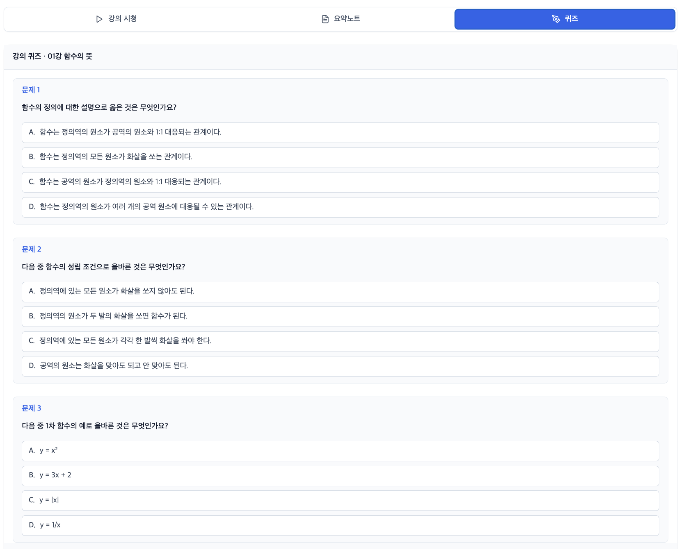
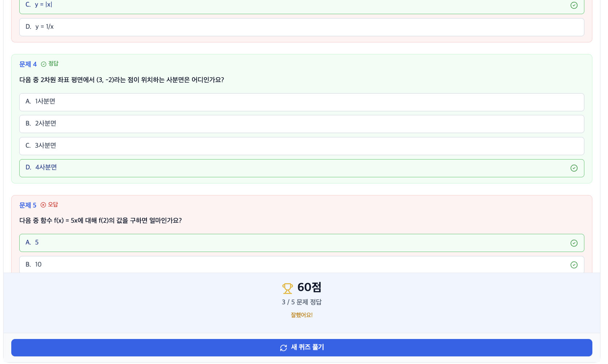

# 내 옆의 강의, 옆강

**인강을 실시간으로 보며 인강 선생님에게 질문을 할 수 있는 챗봇 서비스!** 인강의 말투와 지식을 복제한 AI 챗봇으로, 강의 영상·스크립트·교재를 기반으로 실시간 질의응답, 타임라인 점프, 강의 요약노트, 퀴즈 생성 및 채점을 지원합니다.

## 목차

- [프로젝트 개요](#프로젝트-개요)
- [배포](#배포)
- [주요 기능](#주요-기능)
- [기술 스택](#기술-스택)
- [빠른 시작](#빠른-시작)
- [환경 변수](#환경-변수)
- [프로젝트 구조](#프로젝트-구조)
- [API 엔드포인트](#api-엔드포인트)
- [아키텍처](#아키텍처)
- [기여 가이드](#기여-가이드)

## 프로젝트 개요

옆강(Yeop-Gang)은 **인강을 실시간으로 보며 인강 선생님에게 질문을 할 수 있는 챗봇** 서비스입니다. 온라인 강의 플랫폼에서 강사의 고유한 말투와 교육 철학을 학습하여, 학생들이 강의 내용에 대해 자연스럽게 질문하고 답변을 받을 수 있습니다.

> 💡 비디오 플레이어와 AI 챗봇을 통합하여, 강의를 보는 동안 바로 옆에서 선생님에게 질문하는 것처럼 자연스러운 학습 경험을 제공합니다.

### 서비스 형태

옆강은 완벽한 SaaS(Software as a Service)는 아니지만, SaaS 형태의 구조를 가지고 있습니다:
- **멀티 테넌트 아키텍처**: 강사별로 데이터 격리 및 독립적인 강의 관리
- **웹 기반 서비스**: 브라우저에서 접근 가능한 클라우드 기반 플랫폼
- **역할 기반 접근 제어 (RBAC)**: 강사/학생 역할 분리 및 권한 관리
- **확장 가능한 구조**: 향후 과금 시스템, 사용량 제한, 관리자 대시보드 등 추가 가능

### 핵심 가치

- **페르소나 기반 학습**: 각 강사의 고유한 말투, 교육 철학, 특징적인 표현을 자동으로 분석하여 챗봇에 반영
- **멀티모달 처리**: 비디오, 오디오, PDF 교재, SMI 자막 파일을 통합하여 강의 컨텍스트를 완벽하게 이해
- **실시간 타임라인 연동**: 챗봇 답변 내 타임스탬프를 클릭하면 해당 강의 구간으로 바로 이동
- **과목 특화 기능**: 수학, 영어, 과학 등 과목별 특성에 맞춘 요약노트와 퀴즈 생성

## 배포

옆강은 **Render**를 사용하여 통합 배포됩니다.

### 배포 주소

**프로덕션**: [https://yeop-gang.onrender.com](https://yeop-gang-t41l.onrender.com/)

### 배포 구조

- **통합 배포**: 하나의 Docker 컨테이너에 프론트엔드(Next.js)와 백엔드(FastAPI)를 함께 배포
- **API 프록시**: Next.js API Routes를 통해 `/api/*` 요청을 내부 백엔드(`localhost:8000`)로 프록시
- **포트 관리**: Render는 프론트엔드 포트(3000)만 외부에 노출, 백엔드는 내부 통신만 사용

### 배포 방법

상세한 배포 가이드는 [DEPLOYMENT.md](./DEPLOYMENT.md)를 참고하세요.

**요약:**
1. Render 대시보드에서 Web Service 생성
2. GitHub 저장소 연결
3. Dockerfile 기반 빌드 설정
4. 환경 변수 설정 (OPENAI_API_KEY 등)
5. 배포 완료

## 주요 기능

### 학생용 기능

- **실시간 강의 시청 + 질의응답**: 인강을 보는 동안 바로 옆에서 선생님에게 질문할 수 있는 통합 인터페이스 (비디오 플레이어 + AI 챗봇)
- **AI 챗봇 질의응답**: 강의 내용에 대한 실시간 질문 및 답변 (강사 말투 적용)
- **타임라인 점프**: 챗봇 답변 내 타임스탬프 클릭 시 해당 시간으로 자동 이동
- **요약노트**: 강의 내용 자동 요약 및 주요 포인트 추출 (과목별 특화, 표 형식 지원)
- **퀴즈**: 5문제 객관식 퀴즈 자동 생성, 답변 선택, 자동 채점 및 점수 표시 (과목별 특화)
- **강의 등록**: 원하는 강의를 등록하여 학습
- **강의 검색**: 과목별, 강사별 강의 검색 및 필터링

### 강사용 기능

- **강의 업로드**: 비디오(MP4), 오디오(MP3), PDF 교재, SMI 자막 파일 업로드
- **강의 목록 관리**: 강의 목록 생성, 챕터 추가, 정보 수정, 삭제
- **처리 상태 확인**: 실시간 진행률 표시 (STT, 페르소나 분석, 벡터 DB 저장 등)
- **프로필 관리**: 강사 프로필 정보 조회 및 수정 (이름, 소개, 전문 분야, 프로필 이미지)

### AI 기능

- **자동 STT (Speech-to-Text)**: OpenAI Whisper API를 사용한 음성 전사
- **페르소나 추출**: 강사 스타일 자동 분석 (말투, 교육 철학, 특징 표현) - 강의 목록 단위 관리
- **RAG (Retrieval-Augmented Generation)**: ChromaDB 벡터 검색 + GPT-4o 기반 답변 생성
- **멀티모달 처리**: PDF 이미지/도표 VLM 기반 설명 생성
- **맞춤법 검사**: 한국어 맞춤법 자동 교정 (py-hanspell)
- **가드레일**: 프롬프트 인젝션 방어, 부적절한 질문 필터링

### 특화 기능

- **강의명/회차 구분**: 부모 강의명과 챕터 번호를 명확히 구분하여 인식
- **반복 표현 지양**: 챗봇이 동일한 문구를 반복하지 않고 다양한 표현 사용
- **수학 공식 렌더링**: LaTeX 문법을 읽기 쉬운 일반 텍스트로 변환 (예: `y^2 = 4px`, `√2`, `a/b`)
- **성능 최적화**: 캐싱, 배치 처리, 파일 해시 기반 재사용으로 API 호출 최소화

## 스크린샷

### 메인 페이지




### 챗봇 기능

#### 기본 채팅


#### 시간대별 질문


#### 내용 이해도 질문


### 학습 보조 기능

#### 요약노트


#### 퀴즈


#### 퀴즈 정답 확인


## 기술 스택

### Backend

- **프레임워크**: FastAPI 0.115.0
- **데이터베이스**: 
  - SQLite (메타데이터, 사용자 정보)
  - ChromaDB 0.5.11 (벡터 임베딩 저장)
- **AI/ML**:
  - OpenAI API (GPT-4o-mini, Whisper, Embeddings, VLM)
  - LangChain 0.3.7
  - Sentence Transformers 3.2.1
- **인증**: JWT (python-jose, passlib[bcrypt])
- **기타**: 
  - PyMuPDF 1.24.0 (PDF 처리)
  - py-hanspell (맞춤법 검사, 선택적)
  - tiktoken 0.7.0 (토큰 계산)
  - markdown 3.10 (마크다운 변환)

### Frontend

- **프레임워크**: Next.js 14.2.18
- **언어**: TypeScript 5.6.3
- **스타일링**: Tailwind CSS 3.4.13
- **마크다운**: marked 17.0.1, DOMPurify 3.3.1
- **아이콘**: lucide-react 0.263.1

### 배포

- **플랫폼**: Render (Free Tier)
- **컨테이너**: Docker
- **통합 배포**: Next.js + FastAPI 단일 컨테이너

## 빠른 시작

### 사전 요구사항

- Python 3.11+ (권장)
- Node.js 18+ (권장)
- ffmpeg (STT 사용 시)
- OpenAI API Key
- Docker (배포 시)

### Backend 설정

```bash
# 1. 프로젝트 클론
git clone <repository-url>
cd Yeop-Gang

# 2. 가상환경 생성 및 활성화
cd server
python -m venv .venv
source .venv/bin/activate  # Windows: .venv\Scripts\activate

# 3. 의존성 설치
pip install -r requirements.txt

# 4. 환경 변수 설정
# 루트 디렉토리에 .env 파일 생성 (아래 참고)

# 5. 서버 실행
uvicorn main:app --reload --host 0.0.0.0 --port 8000
```

**확인 사항:**
- 서버 실행 후 http://localhost:8000/ 접속 시 JSON 응답 확인
- http://localhost:8000/docs 에서 Swagger UI 확인

### Frontend 설정

```bash
# 1. 클라이언트 디렉토리로 이동
cd client

# 2. 의존성 설치
npm install

# 3. 환경 변수 설정
# .env.local 파일 생성 (선택적, 개발 환경에서만)
# NEXT_PUBLIC_API_URL=http://localhost:8000

# 4. 개발 서버 실행
npm run dev
```

**확인 사항:**
- http://localhost:3000 접속 시 프론트엔드 화면 확인
- 백엔드 서버가 실행 중인지 확인

### Docker로 통합 실행

```bash
# 1. Docker 이미지 빌드
docker build -t yeopgang-app .

# 2. 컨테이너 실행
docker run -p 3000:3000 \
  -e OPENAI_API_KEY=your_key \
  -e DATABASE_URL=sqlite:///./server/data/yeopgang.db \
  -v $(pwd)/server/data:/app/server/data \
  yeopgang-app

# 3. 접속
# 프론트엔드: http://localhost:3000
# 백엔드 API (내부): http://localhost:8000
```

## 환경 변수

루트 디렉토리에 `.env` 파일을 생성하세요.

### 필수 환경 변수

```env
# OpenAI API
OPENAI_API_KEY=your-openai-key-here

# 데이터베이스
DATABASE_URL=sqlite:///./server/data/yeopgang.db
DATA_ROOT=server/data
CHROMA_DB_PATH=server/data/chroma

# AI 모델 설정
LLM_MODEL=gpt-4o-mini  # 또는 gpt-4o
EMBEDDING_MODEL=text-embedding-3-small

# 인증
JWT_SECRET=your-secret-key-change-in-production

# 서버 설정 (로컬 개발 시)
FRONTEND_URL=http://localhost:3000
BACKEND_URL=http://localhost:8000
```

### 선택적 환경 변수

```env
# Google API (선택사항)
GOOGLE_API_KEY=your-google-key-here
```

**참고:**
- `.env` 파일은 `.gitignore`에 포함되어 커밋되지 않습니다
- 설정은 `dataclass` + `os.getenv`로 로드되며, `.env` 파일 읽기 실패 시 환경 변수에서 읽습니다
- Render 배포 시 환경 변수는 Render 대시보드에서 설정합니다

## 프로젝트 구조

```
Yeop-Gang/
├── server/                 # 백엔드
│   ├── ai/                # AI 엔진 (Backend A)
│   │   ├── pipelines/     # RAG 파이프라인
│   │   │   ├── processor.py  # 강의 자산 처리 오케스트레이션
│   │   │   └── rag.py        # RAG 파이프라인 (검색 + 생성)
│   │   ├── services/      # AI 서비스
│   │   │   ├── stt.py         # Speech-to-Text (Whisper)
│   │   │   ├── embeddings.py  # 텍스트 임베딩
│   │   │   ├── vectorstore.py # ChromaDB 관리
│   │   │   ├── pdf.py         # PDF 처리 (텍스트 + 이미지)
│   │   │   └── smi_parser.py  # SMI 자막 파싱
│   │   ├── style_analyzer.py  # 강사 스타일 분석
│   │   └── config.py      # AI 설정
│   ├── api/               # API 엔드포인트 (Backend B)
│   │   ├── routers.py     # 기존 API 라우터
│   │   ├── dh_routers.py  # 개선된 API 라우터 (인증, 권한)
│   │   ├── schemas.py     # 요청/응답 스키마
│   │   └── dh_schemas.py  # 개선된 스키마
│   ├── core/              # 핵심 기능 (Backend B)
│   │   ├── models.py      # DB 모델 (Instructor, Course, Video)
│   │   ├── dh_models.py   # 추가 모델 (Student, Enrollment)
│   │   ├── db.py          # DB 연결 및 초기화
│   │   ├── dh_auth.py     # JWT 인증/인가
│   │   ├── dh_guardrails.py  # AI 가드레일
│   │   ├── dh_rate_limit.py  # Rate Limiting
│   │   ├── storage.py     # 파일 저장 관리
│   │   └── tasks.py       # Background Tasks
│   ├── main.py            # FastAPI 앱 진입점
│   └── requirements.txt   # Python 의존성
├── client/                # 프론트엔드
│   ├── app/               # Next.js App Router
│   │   ├── api/           # API 프록시 (통합 배포용)
│   │   │   └── [...path]/route.ts  # 백엔드 프록시
│   │   ├── instructor/    # 강사용 페이지
│   │   │   ├── courses/   # 강의 목록/관리
│   │   │   └── upload/    # 강의 업로드
│   │   ├── student/       # 학생용 페이지
│   │   │   ├── courses/   # 등록한 강의 목록
│   │   │   └── play/      # 강의 시청 + 챗봇
│   │   ├── mypage/        # 마이페이지
│   │   ├── search/        # 강의 검색
│   │   └── layout.tsx     # 레이아웃
│   ├── components/        # 재사용 컴포넌트
│   │   ├── VideoPlayer.tsx    # 비디오 플레이어
│   │   ├── ChatPanel.tsx      # 챗봇 패널
│   │   ├── SummaryNote.tsx    # 요약노트
│   │   ├── Quiz.tsx           # 퀴즈
│   │   ├── UploadForm.tsx     # 업로드 폼
│   │   ├── Header.tsx         # 헤더
│   │   └── ...
│   ├── lib/               # 유틸리티
│   │   ├── api.ts         # API 클라이언트
│   │   ├── auth.ts        # 인증 유틸리티
│   │   └── types.ts       # TypeScript 타입
│   └── package.json       # Node.js 의존성
├── data/                  # 데이터 저장소
│   ├── yeopgang.db       # SQLite 데이터베이스
│   ├── chroma/           # ChromaDB 벡터 저장소
│   └── uploads/          # 업로드된 파일
├── ref/                   # 테스트 데이터
│   ├── testcourse1/      # 테스트 강의 1
│   └── testcourse2/      # 테스트 강의 2
├── Dockerfile            # Docker 빌드 파일
├── start.sh              # 통합 실행 스크립트
├── README.md             # 이 파일
├── ARCHITECTURE.md        # 아키텍처 상세 문서
├── DEPLOYMENT.md          # 배포 가이드
├── COLLABORATION_GUIDE.md # 협업 가이드
└── API_README.md         # API 사용 가이드
```

## API 엔드포인트

### 인증 API

| 메서드 | 엔드포인트 | 설명 | 인증 |
|--------|-----------|------|------|
| `POST` | `/api/auth/register/instructor` | 강사 회원가입 | 불필요 |
| `POST` | `/api/auth/register/student` | 학생 회원가입 | 불필요 |
| `POST` | `/api/auth/login` | 로그인 (강사/학생) | 불필요 |

### 강사용 API

| 메서드 | 엔드포인트 | 설명 | 인증 |
|--------|-----------|------|------|
| `POST` | `/api/instructor/courses` | 강의 목록 생성 | 강사 토큰 |
| `POST` | `/api/instructor/upload` | 강의 파일 업로드 | 강사 토큰 |
| `GET` | `/api/instructor/courses` | 강의 목록 조회 | 강사 토큰 |
| `PATCH` | `/api/instructor/courses/{course_id}` | 강의 정보 수정 | 강사 토큰 |
| `DELETE` | `/api/instructor/courses/{course_id}` | 강의 삭제 | 강사 토큰 |
| `GET` | `/api/instructor/profile` | 프로필 정보 조회 | 강사 토큰 |
| `PATCH` | `/api/instructor/profile` | 프로필 정보 수정 | 강사 토큰 |

### 학생용 API

| 메서드 | 엔드포인트 | 설명 | 인증 |
|--------|-----------|------|------|
| `POST` | `/api/student/enroll` | 강의 등록 | 학생 토큰 |
| `GET` | `/api/student/courses` | 등록한 강의 목록 조회 | 학생 토큰 |

### 공통 API

| 메서드 | 엔드포인트 | 설명 | 인증 |
|--------|-----------|------|------|
| `GET` | `/api/health` | 서버 상태 확인 | 불필요 |
| `GET` | `/api/status/{course_id}` | 강의 처리 상태 조회 | 강사/학생 토큰 |
| `GET` | `/api/video/{course_id}` | 비디오/오디오 스트리밍 | 강사/학생 토큰 |
| `POST` | `/api/chat/ask` | AI 챗봇 질의 | 강사/학생 토큰 |
| `GET` | `/api/chat/greeting` | 챗봇 인사말 (페르소나 적용) | 강사/학생 토큰 |
| `POST` | `/api/summary` | 강의 요약 생성 | 강사/학생 토큰 |
| `POST` | `/api/quiz/generate` | 퀴즈 생성 | 강사/학생 토큰 |
| `POST` | `/api/quiz/submit` | 퀴즈 답변 제출 | 강사/학생 토큰 |
| `GET` | `/api/courses` | 공개 강의 목록 조회 | 불필요 |
| `GET` | `/api/courses/{course_id}` | 강의 상세 정보 조회 | 불필요 |
| `GET` | `/api/courses/{course_id}/chapters` | 강의 챕터 목록 조회 | 불필요 |

**상세한 API 사용법은 [API_README.md](./API_README.md)를 참고하세요.**

## 아키텍처

프로젝트의 상세한 아키텍처 설명은 [ARCHITECTURE.md](./ARCHITECTURE.md)를 참고하세요.

주요 내용:
- 시스템 아키텍처 개요
- 데이터 흐름 (업로드 → 처리 → 채팅)
- RAG 파이프라인 상세
- 페르소나 추출 알고리즘 (강의 목록 단위 관리)
- 멀티모달 처리 (PDF 이미지/도표)
- 보안 및 가드레일
- 성능 최적화 (캐싱, 배치 처리, 파일 해시 기반 재사용)
- 배포 아키텍처 (Render 통합 배포)

## 기여 가이드

### 팀원 역할 분담 (R&R)

- **`server/ai` (Backend A)**: RAG 파이프라인, Whisper STT, 페르소나 추출, 멀티모달 처리
- **`server/api`, `server/core` (Backend B)**: 비동기 Task 관리, 멀티 테넌트 DB, API 엔드포인트, 보안, 배포
- **`client` (Frontend)**: 강사/학생 이원화 UI, 타임라인 연동, API 프록시, 동적 테마

 **상세 협업 가이드**: [COLLABORATION_GUIDE.md](./COLLABORATION_GUIDE.md) 참고

### 개발 워크플로우

1. 기능 브랜치 생성: `git checkout -b feature/your-feature`
2. 작업 후 커밋: `git commit -m "feat: your feature"`
3. 원격 저장소에 푸시: `git push origin feature/your-feature`
4. Pull Request 생성 및 코드 리뷰
5. 머지 후 브랜치 삭제

### 코딩 컨벤션

- **Python**: PEP 8 스타일 가이드 준수
- **TypeScript**: ESLint 규칙 준수
- **커밋 메시지**: Conventional Commits 형식 사용
  - `feat`: 새로운 기능
  - `fix`: 버그 수정
  - `docs`: 문서 수정
  - `style`: 코드 포맷팅
  - `refactor`: 코드 리팩토링
  - `test`: 테스트 추가/수정
  - `chore`: 빌드/설정 변경

## 라이선스

이 프로젝트는 교육 목적으로 개발되었습니다.

## 문의

프로젝트 관련 문의사항은 GitHub Issues를 통해 등록해주세요.

---

**옆강(Yeop-Gang)** - hateslop final project
